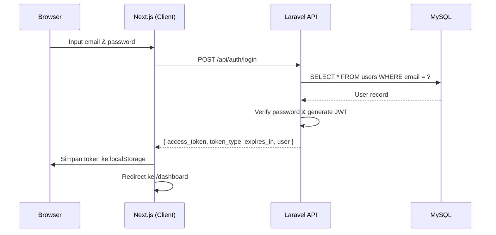
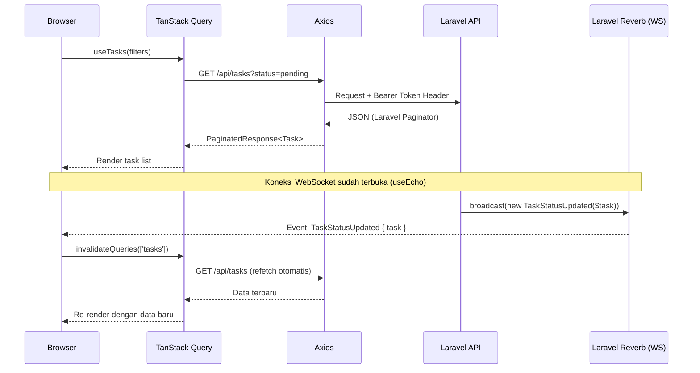
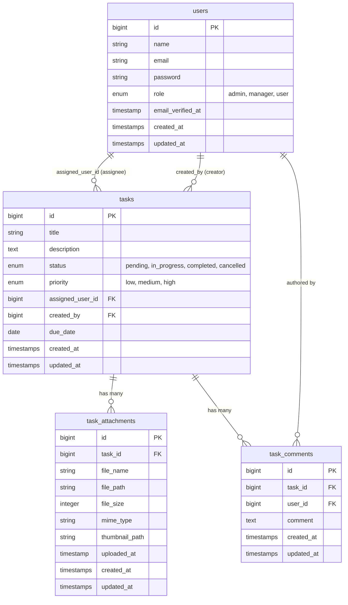

# Task Management System — Technical Architecture

> **Prinsip Panduan: Gemi, Setiti, Ngati-ati**
> _Hemat sumber daya (Gemi), teliti dalam implementasi (Setiti), dan berhati-hati terhadap risiko (Ngati-ati)._

---

## Daftar Isi

1. [High-Level System Architecture](#1-high-level-system-architecture)
2. [Backend Architecture (Laravel)](#2-backend-architecture-laravel)
3. [Frontend Architecture (Next.js)](#3-frontend-architecture-nextjs)
4. [Database Schema & Relations](#4-database-schema--relations)
5. [Infrastructure & Security](#5-infrastructure--security)

---

## 1. High-Level System Architecture

Sistem ini dibangun di atas arsitektur **client-server terpisah** (decoupled). Frontend (Next.js) berkomunikasi dengan Backend (Laravel) melalui dua jalur: **REST API** untuk operasi CRUD dan **WebSocket** (via Laravel Reverb) untuk pembaruan real-time.

```
┌─────────────────────────────────────────────────────────┐
│                     CLIENT (Browser)                    │
│  Next.js App Router · TypeScript · Tailwind CSS         │
│  TanStack Query · Axios · Laravel Echo + pusher-js      │
└────────────┬───────────────────────┬────────────────────┘
             │ HTTPS REST (port 8000) │ WSS (port 8080)
             ▼                        ▼
┌────────────────────┐   ┌────────────────────────────────┐
│  Laravel 11 API    │   │  Laravel Reverb (WebSocket)     │
│  PHP 8.3+          │   │  Private Channel Broadcasting   │
│  JWT Auth          │   └────────────────────────────────┘
│  Queue Worker      │
│  File Storage      │
└────────────┬───────┘
             │
┌─────────┐
│  MySQL  │
│  (data) │
└─────────┘
```

### 1.1 Sequence Diagram: Autentikasi (Login)



### 1.2 Sequence Diagram: Pengambilan Data Task + Real-time Update



---

## 2. Backend Architecture (Laravel)

### 2.1 Design Pattern: Model-Controller

Proyek ini menggunakan pola **Model-Controller** langsung tanpa Service/Repository layer tambahan — pilihan yang _gemi_ untuk codebase berskala menengah. Kompleksitas bisnis ditangani di dalam Controller dengan memanfaatkan fitur bawaan Laravel.

```
app/
├── Http/
│   ├── Controllers/
│   │   ├── AuthController.php        ← JWT auth (login, logout, me, refresh)
│   │   ├── TaskController.php        ← CRUD + bulkUpdate + export
│   │   ├── TaskAttachmentController.php ← upload, download, delete file
│   │   └── TaskCommentController.php ← komentar per task
│   └── Requests/
│       ├── StoreTaskRequest.php      ← validasi form request
│       └── UpdateTaskRequest.php
├── Models/
│   ├── User.php
│   ├── Task.php                      ← scope: byStatus, byPriority
│   ├── TaskAttachment.php
│   └── TaskComment.php
├── Events/
│   ├── TaskStatusUpdated.php         ← ShouldBroadcastNow → PrivateChannel
│   └── CommentCreated.php
├── Jobs/
│   ├── BulkUpdateTaskStatus.php      ← ShouldQueue, tries: 2
│   ├── SendTaskAssignedEmail.php     ← ShouldQueue, tries: 3, backoff: 60s
│   ├── ExportTaskReport.php          ← CSV export ke storage
│   └── ProcessFileThumbnail.php      ← generate thumbnail gambar
└── Mail/
    └── TaskAssignedMailable.php
```

**Visibility Control di `TaskController::index()`:**

- Admin → melihat semua task
- Non-admin → hanya task yang `assigned_user_id = userId` ATAU `created_by = userId`

```php
if (!$isAdmin) {
    $query->where(function ($q) use ($userId) {
        $q->where('assigned_user_id', $userId)
          ->orWhere('created_by', $userId);
    });
}
```

**Query Scope pada `Task` model:**

```php
public function scopeByStatus($query, string $status) {
    return $query->where('status', $status);
}

public function scopeByPriority($query, string $priority) {
    return $query->where('priority', $priority);
}
```

---

### 2.2 Real-time Engine: Laravel Reverb

Laravel Reverb berfungsi sebagai WebSocket server yang terintegrasi penuh dengan sistem broadcasting Laravel.

**Channel yang digunakan:**

| Channel            | Tipe             | Format                    | Event               |
| ------------------ | ---------------- | ------------------------- | ------------------- |
| Task status update | `PrivateChannel` | `tasks.{userId}`          | `TaskStatusUpdated` |
| Komentar task      | `PrivateChannel` | `tasks.{taskId}.comments` | `CommentPosted`     |

**Implementasi Event:**

```php
// app/Events/TaskStatusUpdated.php
class TaskStatusUpdated implements ShouldBroadcastNow
{
    public function __construct(public Task $task) {}

    public function broadcastOn(): array
    {
        return [
            new PrivateChannel('tasks.' . $this->task->assigned_user_id),
        ];
    }
}
```

> **Catatan:** `ShouldBroadcastNow` digunakan agar event di-broadcast **secara sinkron** tanpa melalui queue — memberikan latensi minimum untuk notifikasi real-time yang kritis.

**Channel Authorization** didefinisikan di `routes/channels.php`:

```php
Broadcast::channel('tasks.{userId}', function ($user, $userId) {
    return (int) $user->id === (int) $userId;
});
```

---

### 2.3 Background Processing: Laravel Queue

Queue digunakan untuk operasi yang berat atau tidak perlu segera selesai, sehingga respons API tetap cepat (_gemi_ terhadap waktu respons).

**Jobs yang terdaftar:**

| Job                     | Trigger                       | tries   | backoff  |
| ----------------------- | ----------------------------- | ------- | -------- |
| `BulkUpdateTaskStatus`  | `POST /api/tasks/bulk-update` | 2       | default  |
| `SendTaskAssignedEmail` | Task dibuat/assignee berubah  | 3       | 60 detik |
| `ExportTaskReport`      | `POST /api/tasks/export`      | default | default  |
| `ProcessFileThumbnail`  | File gambar di-upload         | default | default  |

**Alur BulkUpdate:**

```php
// Controller (langsung kembali 200)
BulkUpdateTaskStatus::dispatch($validated['task_ids'], $validated['status']);
return response()->json(['message' => 'Queued...']);

// Job Worker (di background)
public function handle(): void
{
    $tasks = Task::whereIn('id', $this->taskIds)->get();
    Task::whereIn('id', $this->taskIds)->update(['status' => $this->status]);

    foreach ($tasks as $task) {
        $task->status = $this->status;
        TaskStatusUpdated::dispatch($task); // broadcast real-time per task
    }
}
```

---

## 3. Frontend Architecture (Next.js)

### 3.1 State & Data Fetching: TanStack Query

Semua **server state** (data dari API) dikelola oleh TanStack Query. State UI lokal (modal open/close, form input) menggunakan `useState` biasa.

**Query Key Convention:**

```typescript
// hooks/useTasks.ts
const TASKS_KEY = 'tasks';

// List → ['tasks', { status: 'pending', ... }]
useQuery({ queryKey: [TASKS_KEY, filters], ... })

// Detail → ['tasks', 12]
useQuery({ queryKey: [TASKS_KEY, id], ... })
```

**Invalidation setelah Mutasi:**

```typescript
export function useCreateTask() {
  const qc = useQueryClient();
  return useMutation({
    mutationFn: async (payload: TaskPayload) => {
      const { data } = await api.post<ApiResponse<Task>>('/tasks', payload);
      return data.data;
    },
    onSuccess: () => {
      // Invalidate SEMUA query dengan prefix 'tasks'
      qc.invalidateQueries({ queryKey: [TASKS_KEY] });
    },
  });
}

export function useUpdateTask(id: number | string) {
  const qc = useQueryClient();
  return useMutation({
    mutationFn: async (payload) => {
      /* ... */
    },
    onSuccess: (updated) => {
      qc.setQueryData([TASKS_KEY, id], updated); // update cache langsung (optimistic)
      qc.invalidateQueries({ queryKey: [TASKS_KEY] }); // refresh list
    },
  });
}
```

---

### 3.2 Real-time Integration: `useEcho` Hook

Hook `useEcho` mengintegrasikan Laravel Echo dengan siklus hidup komponen React secara **lazy** — Echo hanya diinisialisasi di sisi client setelah autentikasi berhasil.

```typescript
// hooks/useEcho.ts (ringkasan alur)
export function useEcho({ taskId, userId, onComment }: UseEchoOptions = {}) {
  const qc = useQueryClient();

  // --- Effect 1: Private Channel untuk status task user ---
  useEffect(() => {
    if (!userId) return;

    (async () => {
      const echo = await getEcho(); // lazy init, aman untuk SSR
      if (!echo) return;

      const channel = echo.private(`tasks.${userId}`);
      channel.listen('TaskStatusUpdated', (e: { task: Task }) => {
        // 1. Update cache task individual secara optimistik
        qc.setQueryData(['tasks', e.task.id], e.task);
        // 2. Invalidate list agar data list juga segar
        qc.invalidateQueries({ queryKey: ['tasks'] });
      });
    })();

    return () => channel?.stopListening('TaskStatusUpdated'); // cleanup
  }, [userId, qc]);

  // --- Effect 2: Private Channel untuk komentar per task ---
  useEffect(() => {
    if (!taskId) return;

    (async () => {
      const echo = await getEcho();
      const commentChannel = echo.private(`tasks.${taskId}.comments`);
      commentChannel.listen('CommentPosted', (e) => onComment?.(e.comment));
    })();

    return () => commentChannel?.stopListening('CommentPosted'); // cleanup
  }, [taskId, stableOnComment]);
}
```

**Inisialisasi Echo (lazy + singleton):**

```typescript
// lib/echo.ts
let echoInstance: Echo | null = null;

export async function getEcho() {
  if (echoInstance) return echoInstance; // reuse instance yang ada
  if (typeof window === 'undefined') return null; // guard SSR

  // Dynamic import → tidak masuk bundle server-side
  const [{ default: Echo }, { default: Pusher }] = await Promise.all([
    import('laravel-echo'),
    import('pusher-js'),
  ]);

  echoInstance = new Echo({
    broadcaster: 'reverb',
    key: process.env.NEXT_PUBLIC_REVERB_APP_KEY,
    wsHost: process.env.NEXT_PUBLIC_REVERB_HOST,
    wsPort: Number(process.env.NEXT_PUBLIC_REVERB_PORT),
    forceTLS: false,
    authorizer: (channel) => ({
      authorize: (socketId, callback) => {
        axiosInstance
          .post('/broadcasting/auth', {
            socket_id: socketId,
            channel_name: channel.name,
          })
          .then((res) => callback(false, res.data))
          .catch((err) => callback(true, err));
      },
    }),
  });

  return echoInstance;
}
```

> **Pola Singleton:** `echoInstance` disimpan di module scope. Ini memastikan hanya **satu koneksi WebSocket** yang terbuka per sesi browser — _gemi_ terhadap resource koneksi.

---

### 3.3 Performance

**Lazy Loading dengan `next/dynamic`:**

```typescript
// Komponen berat (editor, chart, dll.) dimuat hanya saat diperlukan
const TaskDetailModal = dynamic(() => import('@/components/TaskDetailModal'), {
  loading: () => <Skeleton />,
  ssr: false, // tidak perlu di SSR
});
```

**Axios Request Interceptor (Global 401 Handler):**

```typescript
// lib/axios.ts
api.interceptors.response.use(
  (response) => response,
  (error) => {
    if (error.response?.status === 401 && typeof window !== 'undefined') {
      localStorage.removeItem('auth_token');
      localStorage.removeItem('auth_user');
      if (window.location.pathname !== '/login') {
        window.location.href = '/login'; // hard redirect untuk membersihkan state
      }
    }
    return Promise.reject(error);
  },
);
```

---

## 4. Database Schema & Relations

### Tabel dan Relasi



### Ringkasan Relasi Model

| Model         | Relasi      | Target                                       |
| ------------- | ----------- | -------------------------------------------- |
| `Task`        | `belongsTo` | `User` (via `assigned_user_id`) → `assignee` |
| `Task`        | `belongsTo` | `User` (via `created_by`) → `creator`        |
| `Task`        | `hasMany`   | `TaskAttachment`                             |
| `Task`        | `hasMany`   | `TaskComment`                                |
| `User`        | `hasMany`   | `Task` (sebagai assignee & creator)          |
| `TaskComment` | `belongsTo` | `User`                                       |

---

## 5. Infrastructure & Security

### 5.1 CORS Policy

CORS dikonfigurasi di `config/cors.php` untuk memastikan hanya origin yang diizinkan yang dapat mengakses API:

```php
// config/cors.php
return [
    'paths'               => ['api/*', 'broadcasting/auth'],
    'allowed_methods'     => ['*'],
    'allowed_origins'     => [env('FRONTEND_URL', 'http://localhost:3000')],
    'allowed_origins_patterns' => [],
    'allowed_headers'     => ['*'],
    'exposed_headers'     => [],
    'max_age'             => 0,
    'supports_credentials' => false,
];
```

> **Ngati-ati:** `allowed_origins` tidak boleh diset ke `['*']` di production. Wajib diisi dengan domain frontend spesifik melalui environment variable `FRONTEND_URL`.

---

### 5.2 Middleware & Proteksi Endpoint

Semua endpoint sensitif dilindungi middleware `auth:api` yang memvalidasi JWT token.

**Routing structure:**

```php
// routes/api.php
Route::prefix('auth')->group(function () {
    Route::post('login', [AuthController::class, 'login']);  // publik
    Route::middleware('auth:api')->group(function () {
        Route::post('logout',  [AuthController::class, 'logout']);
        Route::get('me',       [AuthController::class, 'me']);
        Route::post('refresh', [AuthController::class, 'refresh']);
    });
});

Route::middleware('auth:api')->group(function () {
    Route::apiResource('tasks', TaskController::class);
    Route::post('tasks/bulk-update', [TaskController::class, 'bulkUpdate']);
    Route::post('tasks/export',      [TaskController::class, 'export']);
    Route::get('tasks/export/download/{filename}', [TaskController::class, 'downloadExport']);
    Route::post('tasks/{task}/attachments', [TaskAttachmentController::class, 'store']);
    Route::get('attachments/{attachment}/download', [TaskAttachmentController::class, 'download']);
    Route::delete('attachments/{attachment}', [TaskAttachmentController::class, 'destroy']);
});
```

**WebSocket Channel Authorization:**

```php
// routes/channels.php
Broadcast::channel('tasks.{userId}', function ($user, $userId) {
    return (int) $user->id === (int) $userId; // user hanya bisa subscribe channel miliknya
});

Broadcast::channel('tasks.{taskId}.comments', function ($user, $taskId) {
    $task = Task::find($taskId);
    return $task && (
        $user->role === 'admin' ||
        $task->assigned_user_id === $user->id ||
        $task->created_by === $user->id
    );
});
```

---

### 5.3 JWT Token Flow

```
Login → JWT diissue (exp: 3600s) → disimpan di localStorage
                                            ↓
                              Setiap request: Bearer {token}
                                            ↓
                              Token expired → 401 Response
                                            ↓
                     Axios interceptor → clear localStorage → redirect /login
```

> **Catatan Keamanan:** Token disimpan di `localStorage`. Untuk lingkungan dengan kebutuhan keamanan lebih tinggi, pertimbangkan migrasi ke **HttpOnly Cookie** untuk mencegah akses via XSS.

---

### 5.4 File Upload Security

`TaskAttachmentController` menerapkan validasi ketat pada setiap upload:

```php
$request->validate([
    'file' => [
        'required',
        'file',
        'max:102400',  // maks 100MB
        'mimes:jpg,jpeg,png,gif,webp,pdf,doc,docx,xls,xlsx,txt,csv,mp4,mov,avi',
    ],
]);
```

File disimpan di `storage/app/public/attachments` dengan nama yang di-randomize oleh Laravel (`storeAs` menggunakan `Str::random()`), mencegah path traversal dan file name collision.

---

_Dokumen ini mencerminkan implementasi aktual per **2026-05-05**. Update dokumen ini setiap kali terdapat perubahan arsitektural signifikan._
